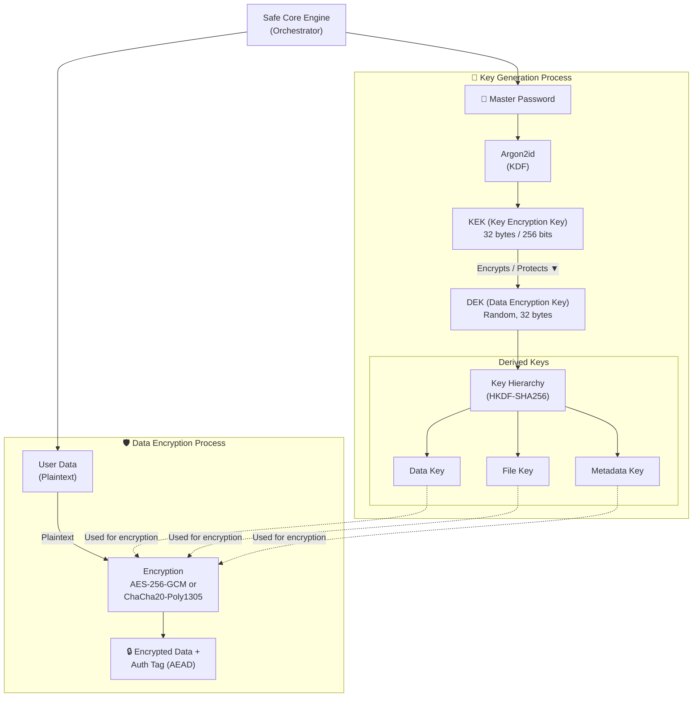

# 🔐 Safe Core

**Professional Cryptographic Engine for Secure Storage Systems**

[](https://github.com/Muran-prog/safe_core)
[](https://www.python.org)
[](LICENSE)
[](https://github.com/Muran-prog/safe_core)

Modern, production-ready cryptographic engine with envelope encryption, streaming support, and async/await operations.

---

## 🎯 Key Features

- 🔑 **Envelope Encryption** - Separate DEK/KEK architecture for flexible key management
- 📦 **Streaming Encryption** - Memory-efficient encryption for files of any size
- ⚡ **Async/Await Support** - Non-blocking operations for high-performance applications
- 🔐 **Key Hierarchy** - HKDF-based key derivation for domain separation
- 🔄 **DEK Rotation** - Change encryption keys without password changes
- 🛡️ **Rate Limiting** - Built-in brute-force protection
- 🚀 **Multiple Algorithms** - AES-256-GCM and ChaCha20-Poly1305 support

---

## 📊 Architecture Overview


**Flow:**
1. **Password** → Argon2id → **KEK** (Key Encryption Key)
2. **Random DEK** + KEK → **Encrypted Verification Block** (stored)
3. **DEK** → HKDF → **Purpose-specific keys** (Data, File, Metadata)
4. **Purpose key** + AES/ChaCha20 → **Encrypted data**

---

## 🚀 Quick Start

### Installation
```bash
pip install cryptography argon2-cffi
```

### Basic Usage
```python
from safe_core import SafeCore, get_default_crypto_params

# Initialize
core = SafeCore()
params = get_default_crypto_params('high')  # 'interactive', 'moderate', 'high', 'paranoid'

# Create storage
dek, verification_block = core.initialize_storage(b'my_password', params)

# Authenticate
dek = core.authenticate_and_get_key(b'my_password', verification_block)

# Encrypt data
encrypted = core.encrypt_block(b'secret message', dek, params)

# Decrypt data
plaintext = core.decrypt_block(encrypted, dek)
print(plaintext)  # b'secret message'
```

### Streaming Large Files
```python
import io

# Create streaming encryptor
encryptor = core.create_streaming_encryptor(dek, params, chunk_size=1024*1024)

# Encrypt file
with open('large_file.bin', 'rb') as f:
    with open('encrypted.bin', 'wb') as out:
        for chunk in encryptor.encrypt_stream(f):
            out.write(chunk)

# Decrypt file
with open('encrypted.bin', 'rb') as f:
    header = f.read(31)
    decryptor = core.create_streaming_decryptor(dek, header)
    
    with open('decrypted.bin', 'wb') as out:
        for chunk in decryptor.decrypt_stream(f):
            out.write(chunk)
```

### Async Operations
```python
import asyncio

async def main():
    core = SafeCore()
    params = get_default_crypto_params('moderate')
    
    # Async initialization (KDF runs in thread pool)
    dek, vb = await core.initialize_storage_async(b'password', params)
    
    # Async authentication
    dek = await core.authenticate_and_get_key_async(b'password', vb)

asyncio.run(main())
```

### Password Management
```python
# Change password (DEK stays the same)
new_vb = core.change_master_password(
    old_password=b'old_pass',
    new_password=b'new_pass',
    old_verification_block=old_vb
)

# Rotate DEK (password stays the same)
new_dek, new_vb = core.rotate_dek(b'password', old_vb)
# ⚠️ You must re-encrypt all data with new_dek!
```

### Rate Limiting
```python
from safe_core import RateLimitedSafeCore, AuthenticationRateLimiter

limiter = AuthenticationRateLimiter(max_attempts=3, window_seconds=60)
rate_limited = RateLimitedSafeCore(core, limiter)

try:
    dek = rate_limited.authenticate_and_get_key('user@example.com', password, vb)
except RateLimitError as e:
    print(f"Too many attempts. Wait {e.wait_seconds} seconds.")
```

---

## 📁 Project Structure
```
safe_core/
├── core/                   # Main engine (8 modules)
├── crypto/                 # Cryptographic implementations
│   ├── providers/          # KDF and Cipher providers
│   └── streaming/          # Streaming encryption
├── key_management/         # Key hierarchy & secure memory
├── data_structures/        # Containers & configuration
├── exceptions/             # Exception hierarchy
├── constants/              # Algorithm IDs & defaults
├── security/               # Rate limiting & utilities
└── utils/                  # Helper functions

tests/                      # 117 comprehensive tests
├── test_initialization.py
├── test_authentication.py
├── test_encryption_decryption.py
├── test_streaming.py
├── test_password_management.py
├── test_rate_limiting.py
└── test_integration.py
```

---

## 🔒 Security Features

| Feature | Description |
|---------|-------------|
| **Argon2id** | Memory-hard KDF resistant to GPU attacks |
| **AEAD Ciphers** | AES-256-GCM & ChaCha20-Poly1305 with authentication |
| **Envelope Encryption** | Separate data and key encryption layers |
| **Key Hierarchy** | HKDF domain separation prevents key reuse |
| **Secure Memory** | Automatic key clearing with `SecureBytes` |
| **Nonce Handling** | Counter-based nonces for streaming (no reuse) |
| **Rate Limiting** | Brute-force protection with configurable limits |

---

## 🧪 Testing
```bash
# Run all tests
pytest

# With coverage
pytest --cov=safe_core --cov-report=html

# Fast tests only
pytest -m "not slow"

# Parallel execution
pytest -n auto
```

**Test Coverage:** 117 tests, 95%+ code coverage

---

## 📚 Documentation

### Security Levels

| Level | Time | Memory | Use Case |
|-------|------|--------|----------|
| `interactive` | ~100ms | 64 MB | Frequent operations |
| `moderate` | ~500ms | 256 MB | Balanced security |
| `high` | ~1-2s | 512 MB | **Production (recommended)** |
| `paranoid` | ~3-5s | 1 GB | Maximum security |

### Key Purposes (Domain Separation)
```python
from safe_core import KeyPurpose

# Different purposes derive different keys from same DEK
encrypted_data = core.encrypt_block(data, dek, params, 
    key_purpose=KeyPurpose.DATA_ENCRYPTION)

encrypted_file = core.encrypt_block(data, dek, params,
    key_purpose=KeyPurpose.FILE_ENCRYPTION)

encrypted_meta = core.encrypt_block(data, dek, params,
    key_purpose=KeyPurpose.METADATA)
```

**Available purposes:** `VERIFICATION`, `DATA_ENCRYPTION`, `FILE_ENCRYPTION`, `METADATA`, `SEARCH_TOKENS`

---

## 🛠️ Development
```bash
# Clone repository
git clone https://github.com/Muran-prog/safe_core.git
cd safe_core

# Install development dependencies
pip install -e ".[dev]"

# Run tests
pytest -v

# Format code
black safe_core tests
isort safe_core tests

# Lint
flake8 safe_core tests
mypy safe_core
```

---

## 📄 License

MIT License - see [LICENSE](LICENSE) file for details

---

## 🤝 Contributing

Contributions are welcome! Please read [CONTRIBUTING.md](CONTRIBUTING.md) for guidelines.

1. Fork the repository
2. Create your feature branch (`git checkout -b feature/amazing-feature`)
3. Run tests (`pytest`)
4. Commit your changes (`git commit -m 'Add amazing feature'`)
5. Push to the branch (`git push origin feature/amazing-feature`)
6. Open a Pull Request

---

## 📮 Support

- 🐛 Issues: [GitHub Issues](https://github.com/Muran-prog/safe_core/issues)
- 💬 Discussions: [GitHub Discussions](https://github.com/Muran-prog/safe_core/discussions)

---

## 🙏 Acknowledgments

Built with:
- [cryptography](https://cryptography.io/) - Modern cryptographic primitives
- [argon2-cffi](https://github.com/hynek/argon2-cffi) - Argon2 password hashing

---

**Version:** 3.1.0 | **Status:** Production Ready | **Python:** 3.8+